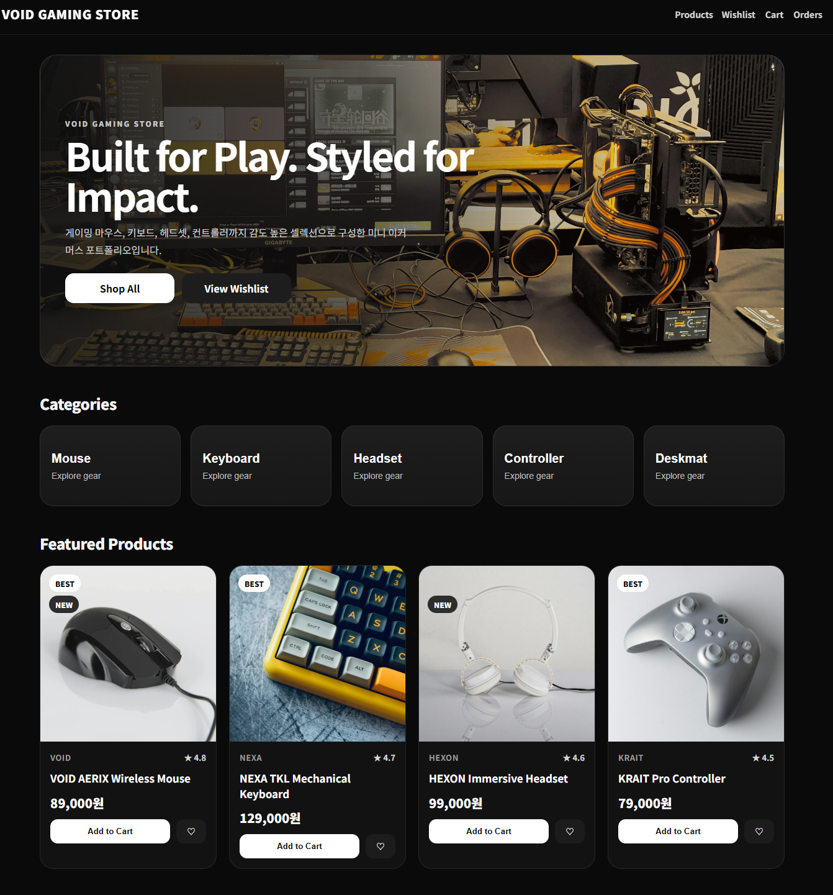
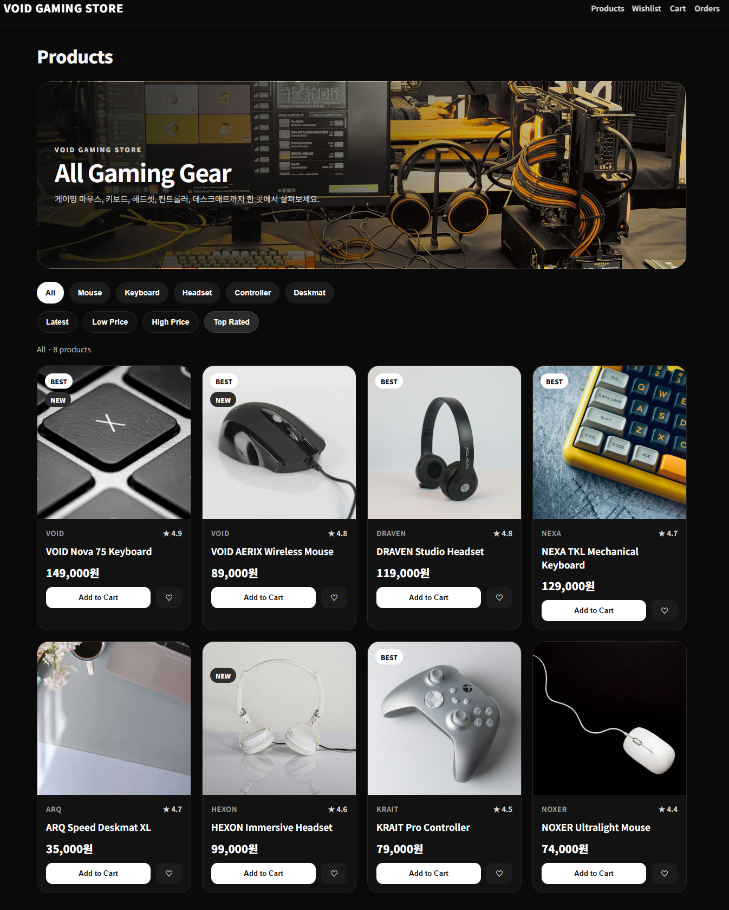
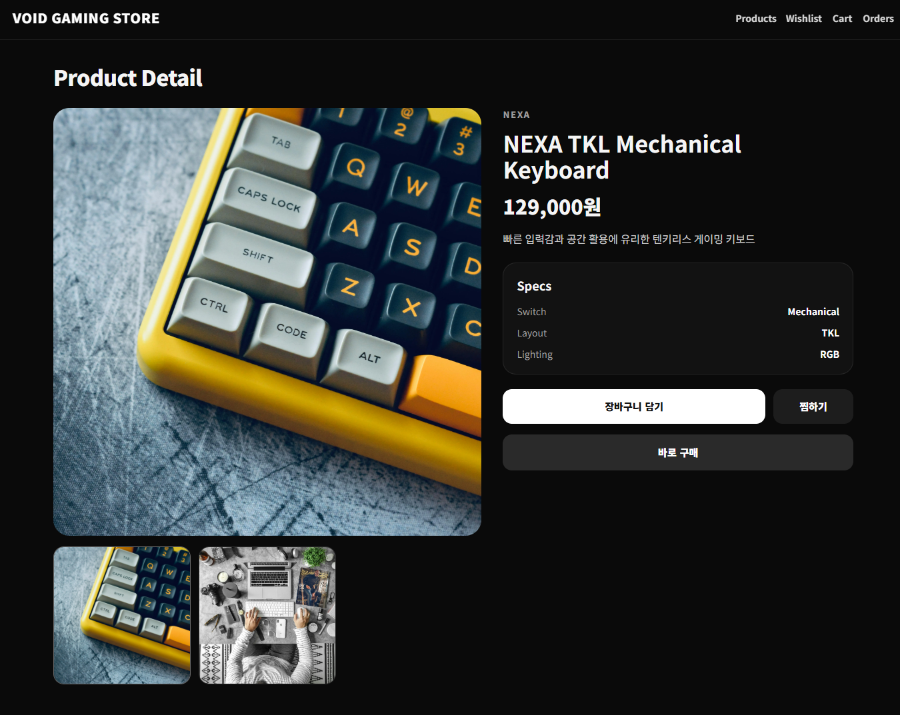
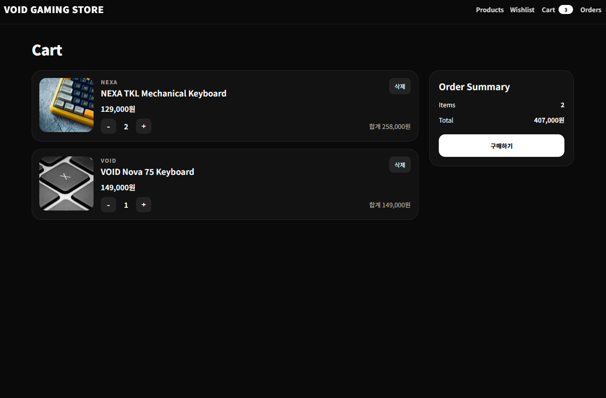
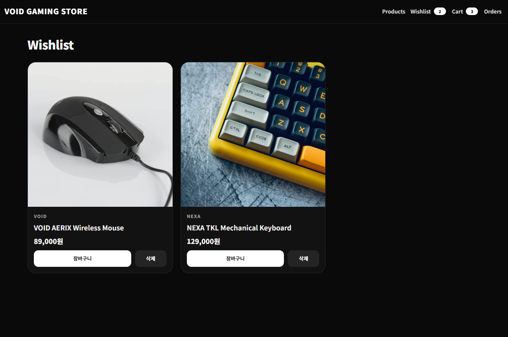
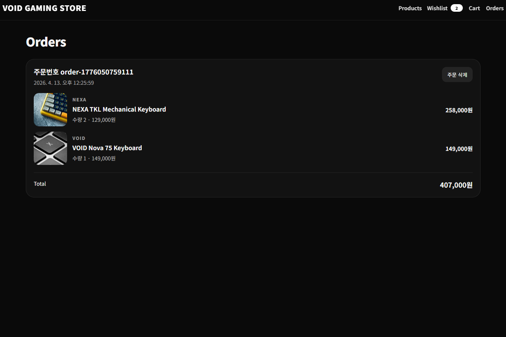

# VOID GAMING STORE

React와 Zustand를 활용해 구현한 미니 이커머스 프로젝트입니다.  
게이밍 마우스, 키보드, 헤드셋, 컨트롤러, 데스크매트 등의 상품을 탐색하고,  
장바구니, 위시리스트, 주문내역까지 이어지는 기본 커머스 흐름을 구현했습니다.

단순한 UI 구현에 그치지 않고, 상태관리, 카테고리 필터링, 정렬, 상세 페이지, 주문 흐름, 반응형 대응까지 포함하여 실제 서비스 구조를 고려한 프론트엔드 포트폴리오 프로젝트로 제작했습니다.

---

## Preview

- Live Demo: [배포 링크 입력]
- Portfolio Post: [포트폴리오 링크 입력]

### Screenshots

| Home                           | Products                           |
| ------------------------------ | ---------------------------------- |
|  |  |

| Product Detail                   | Cart                           |
| -------------------------------- | ------------------------------ |
|  |  |

| Wishlist                           | Orders                           |
| ---------------------------------- | -------------------------------- |
|  |  |

---

## Tech Stack

- React
- React Router
- Zustand
- Emotion
- Vite

---

## Features

- 상품 목록 조회
- 카테고리 필터
- 가격 / 평점 정렬
- 상품 상세 페이지
- 위시리스트 추가 / 삭제
- 장바구니 추가 / 수량 변경 / 삭제
- 주문 생성 및 주문내역 확인
- localStorage 기반 상태 유지
- 스켈레톤 UI
- 반응형 레이아웃

---

## Key Points

- Zustand를 활용해 장바구니, 위시리스트, 주문내역, 필터 상태를 전역 관리했습니다.
- 카테고리 선택에 따라 상단 배너와 상품 목록이 함께 변경되도록 설계했습니다.
- 상품 및 배너 이미지를 import 구조로 정리하여 자산 관리 안정성을 높였습니다.
- 공통 컴포넌트(ProductCard, EmptyState, Skeleton)를 분리해 재사용성을 높였습니다.
- 모바일 환경에서도 자연스럽게 동작하도록 레이아웃과 타이포그래피를 조정했습니다.

---

## Pages

### 1. Home

- 메인 히어로 배너
- 카테고리 카드
- 추천 상품 섹션
- 카테고리 클릭 시 상품 목록 페이지로 이동 및 필터 적용

### 2. Products

- 카테고리별 배너
- 카테고리 필터
- 정렬 기능
- 상품 카드 리스트
- 스켈레톤 로딩 UI

### 3. Product Detail

- 대표 이미지 및 썸네일 갤러리
- 상품 정보 및 스펙
- 찜하기
- 장바구니 담기
- 바로 구매

### 4. Cart

- 장바구니 상품 리스트
- 수량 증가 / 감소
- 상품 삭제
- 총 금액 계산
- 구매하기

### 5. Wishlist

- 찜한 상품 모아보기
- 상세 페이지 이동
- 장바구니 추가
- 위시리스트 삭제

### 6. Orders

- 주문내역 확인
- 주문 상품 리스트
- 총 금액 확인
- 주문 삭제

---

## Project Structure

```bash
src
├─ assets
│  └─ images
│     ├─ banners
│     └─ products
├─ components
│  ├─ common
│  ├─ layout
│  └─ product
├─ data
├─ features
│  ├─ home
│  ├─ products
│  ├─ cart
│  ├─ wishlist
│  └─ orders
├─ store
├─ utils
├─ App.jsx
└─ main.jsx
```
